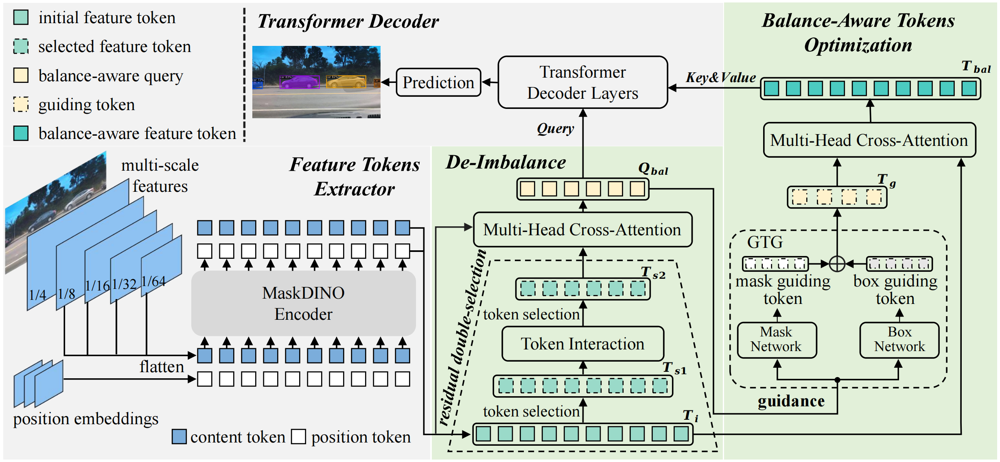

<h2 align="center"> <a href="https://arxiv.org/abs/2410.16707">DI-MaskDINO: A Joint Object Detection and Instance Segmentation Model</a></h2>
<h4 align="center" color="A0A0A0"> Zhixiong Nan, Xianghong Li, Tao Xiang*, Jifeng Dai</h4>
<h5 align="center"> If you like our project, please give us a star ⭐ on GitHub for the latest update.</h5>

<div align="center">

[](https://arxiv.org/abs/2410.16707)
[](https://github.com/CQU-ADHRI-Lab/DI-MaskDINO)
[](https://github.com/CQU-ADHRI-Lab/DI-MaskDINO/blob/main/LICENSE)

</div>

<div align=center>

</div>


# DI-MaskDINO
This is the official implementation of the paper "DI-MaskDINO: A Joint Object Detection and Instance Segmentation Model".

<div align="center">
  
</div><br/>

Motivated by an interesting phenomenon that _the performance of object detection lags behind that of instance segmentation at the beignning decoder layer_, **DI-MaskDINO** is proposed to alleviate the detection-segmentation imbalance issue.
**DI-MaskDINO** is implemented by configuring proposed **_De-Imbalance (DI)_** module and **_Balance-Aware Tokens Optimization (BATO)_** module to MaskDINO.
**_DI_** module contributes to strengthen the detection task at the beginning decoder layer to balance the performance of the two tasks, and the core of **_DI_** module is _residual double-selection mechanism_.
**DI-MaskDINO** outperforms existing SOTA joint object detection and instance segmentation model MaskDINO (**+1.2** _AP<sup> box</sup>_ and **+0.9** _AP<sup> mask</sup>_ on COCO, using ResNet50 backbone with 12 training epochs), SOTA object detection model DINO (**+1.0** _AP<sup> box</sup>_ on COCO), and SOTA segmentation model Mask2Former(**+3.0** _AP<sup> mask</sup>_ on COCO).

## Update
[2024/12] Code for [DI-MaskDINO](https://github.com/CQU-ADHRI-Lab/DI-MaskDINO) is available here!

[2024/9] DI-MaskDINO has been accepted at NeurIPS 2024 as a poster!

## Installation

We tested our code with `Python=3.7.16, PyTorch=1.9.0, CUDA=11.1`. Please install PyTorch first according to [official instructions](https://pytorch.org/get-started/previous-versions/). Our code is based on [detectron2](https://github.com/facebookresearch/detectron2). Please refer to the [installation](https://detectron2.readthedocs.io/en/latest/tutorials/install.html) of detectron2.

Example conda environment setup：

```bash
# Create a new virtual environment
conda create -n dimaskdino python=3.7
conda activate dimaskdino

# Install PyTorch
conda install pytorch==1.9.0 torchvision==0.10.0 cudatoolkit=11.1 -c pytorch -c nvidia

# Install opencv
pip install opencv-python

# Install detectron2
python -m pip install detectron2 -f https://dl.fbaipublicfiles.com/detectron2/wheels/cu111/torch1.9/index.html

# Under your working directory
git clone https://github.com/CQU-ADHRI-Lab/DI-MaskDINO.git
cd DI-MaskDINO
pip install -r requirements.txt

# CUDA kernel for MSDeformAttn
cd dimaskdino/modeling/pixel_decoder/ops
sh make.sh
```

## Models

<table style="width: 100%; border-collapse: collapse;"  id="model-table">
    <tr style="border: 1px solid black; background-color: #f2f2f2; text-align: center; padding: 8px;">
        <th align="center">Name</th>
        <th align="center">Backbone</th>
        <th align="center">Epochs</th>
        <th align="center"><i>AP<sup style="font-size: smaller;">box</sup></i></th>
        <th align="center"><i>AP<sup style="font-size: smaller;">mask</sup></i></th>
        <th align="center">Download</th>
    </tr>
    <tr align="center">
        <td align="center"><a href="./configs/dimaskdino_r50_4scale_bs16_12ep.yaml" style="text-decoration: none; color: black;">DI-MaskDINO</a></td>
        <td align="center">ResNet50</td>
        <td align="center">12</td>
        <td align="center">46.9</td>
        <td align="center">42.3</td>
        <td align="center"><a href="https://drive.google.com/file/d/1oQociMQSt_jmQtH3pm92i6zat8Gt83Oh/view?usp=drive_link" style="text-decoration: none; color: blue;">model</a></td>
    </tr>
    <tr align="center">
        <td align="center"><a href="./configs/dimaskdino_r50_4scale_bs16_24ep.yaml" style="text-decoration: none; color: black;">DI-MaskDINO</a></td>
        <td align="center">ResNet50</td>
        <td align="center">24</td>
        <td align="center">49.6</td>
        <td align="center">44.8</td>
        <td align="center"><a href="https://drive.google.com/file/d/1FjoYiwGnrk_bk0nUM7GPeIMGENVLdx7n/view?usp=drive_link" style="text-decoration: none; color: blue;">model</a></td>
    </tr>
    <tr align="center">
        <td align="center"><a href="./configs/dimaskdino_r50_4scale_bs16_50ep.yaml" style="text-decoration: none; color: black;">DI-MaskDINO</a></td>
        <td align="center">ResNet50</td>
        <td align="center">50</td>
        <td align="center">51.9</td>
        <td align="center">46.7</td>
        <td align="center"><a href="https://drive.google.com/file/d/17_SErWYBWWCdYfR6i7OJtcBIlCDES10z/view?usp=drive_link" style="text-decoration: none; color: blue;">model</a></td>
    </tr>
</table>

## Run

### Training

Train DI-MaskDINO with 8 GPUs:

```sh
python train_net.py --num-gpus 8 --config-file configs/dimaskdino_r50_4scale_bs16_12ep.yaml OUTPUT_DIR /path/to/output
```

### Evaluation

You can download our pretrained models and evaluate them with the following commands. 
```sh
python train_net.py --eval-only --num-gpus 8 --config-file /path/to/config_file MODEL.WEIGHTS /path/to/checkpoint_file
```
For example, to reproduce our result, you can copy the config path from the model table, download the pretrained checkpoint into `/path/to/checkpoint_file`, and run 
```sh
python train_net.py --eval-only --num-gpus 8 --config-file configs/dimaskdino_r50_4scale_bs16_12ep.yaml MODEL.WEIGHTS /path/to/checkpoint_file
```


## <a name="CitingDIMaskDINO"></a>Citing DI-MaskDINO

If you find our work helpful for your research, please consider citing the following BibTeX entry.

```BibTeX
@inproceedings{nan2024di,
  title={DI-MaskDINO: A Joint Object Detection and Instance Segmentation Model}, 
  author={Zhixiong Nan and Xianghong Li and Tao Xiang and Jifeng Dai},
  booktitle={Proceedings of the Neural Information Processing Systems},
  year={2024}
}
```

## Acknowledgement

Many thanks to these excellent opensource projects: 
* [MaskDINO](https://github.com/IDEA-Research/MaskDINO)
* [Mask2Former](https://github.com/facebookresearch/Mask2Former) 
* [DINO](https://github.com/IDEA-Research/DINO)
